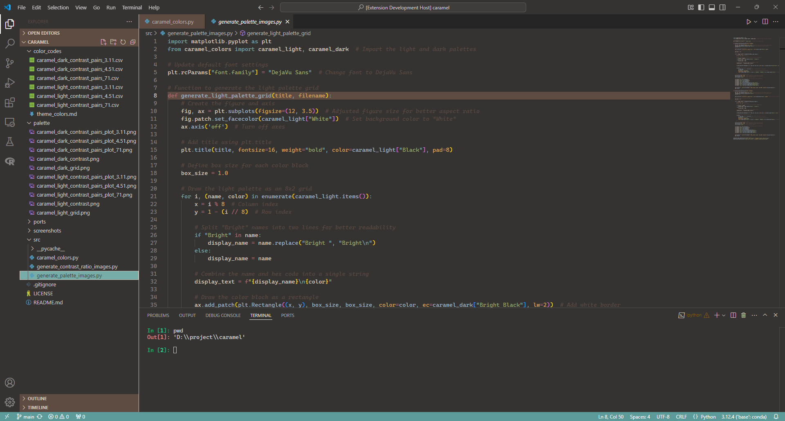
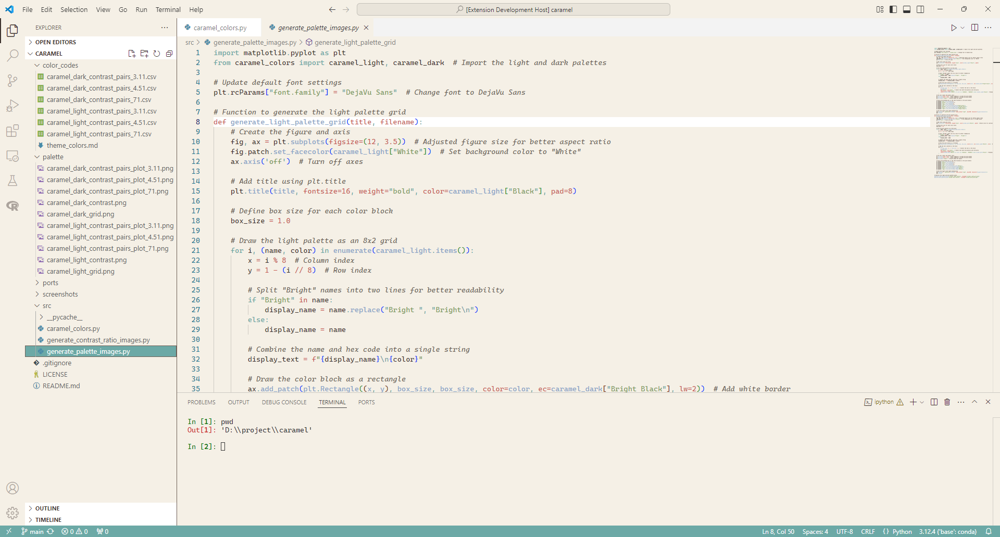

# Caramel Theme for VSCode

The **Caramel Theme** is a meticulously crafted color scheme for Visual Studio Code, inspired by warm, earthy tones. It combines soft, muted accents with harmonious contrasts to create a visually appealing and highly functional palette. Designed with accessibility in mind, the Caramel Theme complies with WCAG (Web Content Accessibility Guidelines) standards to ensure readability and usability for all users.

## Features
- **Two Variants**: Includes both **Caramel Dark** and **Caramel Light** to suit different preferences and environments.
- **Accessibility**: Carefully selected colors prioritize contrast and readability, making it suitable for users with visual impairments and varied lighting conditions.
- **Balanced Palette**: The theme's muted tones reduce eye strain while maintaining aesthetic appeal.

For a more detailed analysis of the color scheme, visit the [Caramel repository on Github](https://github.com/TheRealSwayamShree/caramel).

## Screenshots
### Caramel Dark

### Caramel Light

## Installation
1. Open Visual Studio Code.
2. Go to the **Extensions** view by pressing `Ctrl+Shift+X` or clicking the Extensions icon in the Activity Bar.
3. Search for **Caramel Theme**.
4. Click **Install**.
5. Navigate to `File > Preferences > Color Theme` and select either **Caramel Dark** or **Caramel Light**.

## Manual Installation
1. Download the `.vsix` file from the [latest release](https://github.com/TheRealSwayamShree/caramel-theme/releases).
2. Open Visual Studio Code.
3. Go to the **Extensions View** (`Ctrl + Shift + X`).
4. Click the three-dot menu in the top-right corner and select **Install from VSIX...**.
5. Choose the downloaded `.vsix` file to install the theme.
6. Navigate to `File > Preferences > Color Theme` and select either **Caramel Dark** or **Caramel Light**.

## Contributing
At this time, I am not accepting contributions. However you are welcome to **report issues** in this repository or fork it to make your own modifications.

## License
This theme is licensed under the [MIT License](LICENSE).

